# Structure and Physiology Guided Generative Compression for High-Fidelity Echocardiography Video Reconstruction

<p align="center">
  <strong>Official repository for our echocardiography video compression and reconstruction project</strong>
</p>

<p align="center">
  <a href="#overview">Overview</a> •
  <a href="#method">Method</a> •
  <a href="#Qualitative-Results">Qualitative Results</a> •
  <a href="#release-plan">Release Plan</a> •
  <a href="#contact">Contact</a>  •
</p>

---

## Authors

**Li Longxi** 1, **Guo Yanbin** 1, **Liu Yingbin** 1, **Yu Xianwen** 1, **Wang  Guoping** 1*

1 Hubei Bioinformatics & Molecular Imaging Key Laboratory, Department of Biomedical Engineering, College of Life Science and Technology, Huazhong University of Science and Technology, Wuhan, 430074, China

* Corresponding author

---

## Contact

For questions, technical discussions, or academic collaborations, please contact:

- **Li Longxi** — longxili@hust.edu.cn

---

## Overview

This repository is the official project page for the paper:

**_Structure and Physiology Guided Generative Compression for High-Fidelity Echocardiography Video Reconstruction_**

Echocardiography is a core imaging modality for cardiac function assessment, but long-term storage and transmission of full video sequences remain challenging under the rapid growth of medical data. To address this problem, we propose a generative compression–reconstruction framework that combines:

- **structural priors** from end-diastolic (ED) and end-systolic (ES) key frames, and
- **physiological temporal priors** from continuous cardiac phase information.


## Method

Our framework consists of two main components:

### 1. High-Frequency Semantic Encoder (HFSE)

HFSE learns compact latent representations from echocardiographic frames while preserving:

- global anatomical semantics,
- local structural boundaries, and
- high-frequency texture details.

### 2. AnchorPhaseFlow

AnchorPhaseFlow reconstructs the full echocardiography video in latent space by jointly leveraging:

- ED/ES structural anchors, and
- continuous cardiac phase priors.

This design allows the model to generate more physiologically consistent and structurally faithful cardiac motion across the full cycle.

---

## Qualitative Results

This section presents representative results from three complementary perspectives: HFSE reconstruction quality, dynamic video reconstruction, and clinical validation through left ventricular segmentation.

---

### 1. HFSE Reconstruction Results

<table align="center">
  <tr>
    <td align="center">
      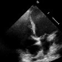
      <br>
      <sub><b>Comparison 1</b></sub>
    </td>
  </tr>
  <tr>
    <td align="center">
      
      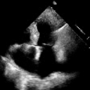<br>
      <sub><b>Comparison 2</b></sub>
    </td>
  </tr>
  <tr>
    <td align="center">
      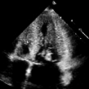
      <br>
      <sub><b>Comparison 3</b></sub>
    </td>
  </tr>
</table>

<p align="center">
  <em>
    Figure 1. Representative HFSE reconstruction comparisons. Each pair shows a visual comparison for one example, highlighting the ability of HFSE to preserve anatomical structures and local details under compact latent representation.
  </em>
</p>

---

### 2. Dynamic Video Reconstruction Results

<table align="center">
  <tr>
    <td align="center">
      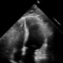
      <br>
      <sub><b>Comparison 1</b></sub>
    </td>
  </tr>
  <tr>
    <td align="center">
      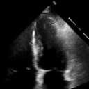
      <br>
      <sub><b>Comparison 2</b></sub>
    </td>
  </tr>
  <tr>
    <td align="center">
      
      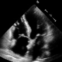<br>
      <sub><b>Comparison 3</b></sub>
    </td>
  </tr>
</table>

<p align="center">
  <em>
    Figure 2. Representative dynamic video reconstruction comparisons. Each pair illustrates one example of cardiac motion reconstruction, showing the preservation of temporal continuity and structural evolution across the cardiac cycle.
  </em>
</p>

---

### 3. Clinical Validation via Left Ventricular Segmentation

<table align="center">
  <tr>
    <td align="center">
      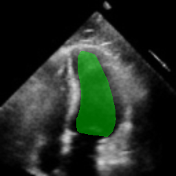
      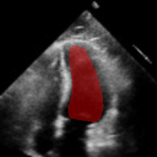<br>
      <sub><b>Comparison 1</b></sub>
    </td>
  </tr>
  <tr>
    <td align="center">
      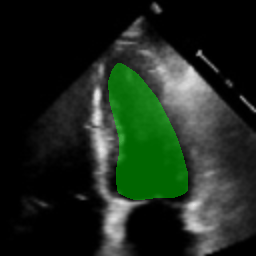
      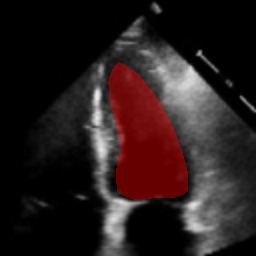<br>
      <sub><b>Comparison 2</b></sub>
    </td>
  </tr>
  <tr>
    <td align="center">
      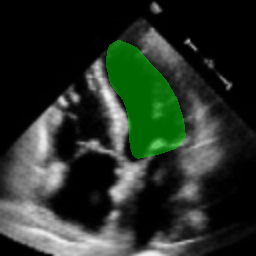
      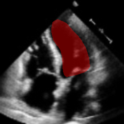<br>
      <sub><b>Comparison 3</b></sub>
    </td>
  </tr>
</table>

<p align="center">
  <em>
    Figure 3. Clinical validation examples based on left ventricular segmentation. Each pair compares the dynamic segmentation results for one case, indicating that the reconstructed videos retain clinically meaningful structural and functional information.
  </em>
</p>
---

### Highlights

- The proposed framework achieves high-fidelity reconstruction under compact latent representation settings.
- HFSE improves structural detail preservation compared with conventional latent encoding strategies.
- AnchorPhaseFlow better models dynamic cardiac motion by integrating structural and physiological priors.
- Reconstructed videos maintain strong consistency in clinically relevant functional measurements.

---

## Release Plan

The complete implementation is **not publicly released at this stage**.

We will release the following materials after the paper is formally published:

- full training and inference code,
- pretrained model weights,
- data preprocessing pipeline,
- evaluation scripts, and
- detailed usage instructions.

This repository currently serves as the official project page for the work.

---

## Repository Structure

The full project structure will be released after publication. A typical organization is expected as follows:

```text
├── assets/                  # figures and visual materials for README
├── configs/                 # training and evaluation configurations
├── datasets/                # dataset preprocessing utilities
├── models/                  # model definitions
├── scripts/                 # training / testing scripts
├── utils/                   # helper functions
└── README.md
```
